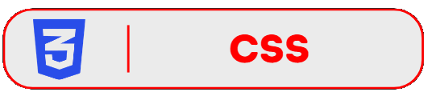

# Olá! Eu sou Cabete 👋

Sou estudante do 3º ano do Ensino Médio Técnico em Desenvolvimento de Sistemas e moro em São Paulo, Brasil.

Atualmente estou aprendendo e desenvolvendo projetos com HTML, CSS e JavaScript, além de utilizar Git e GitHub para organizar e compartilhar meus códigos. Comecei a estudar Python.

---

## Redes Sociais:

  
  
  <a href="mailto:marianacabete01@gmail.com"> 

## Linguagens:

   
  
  

## Feramentas:

  

